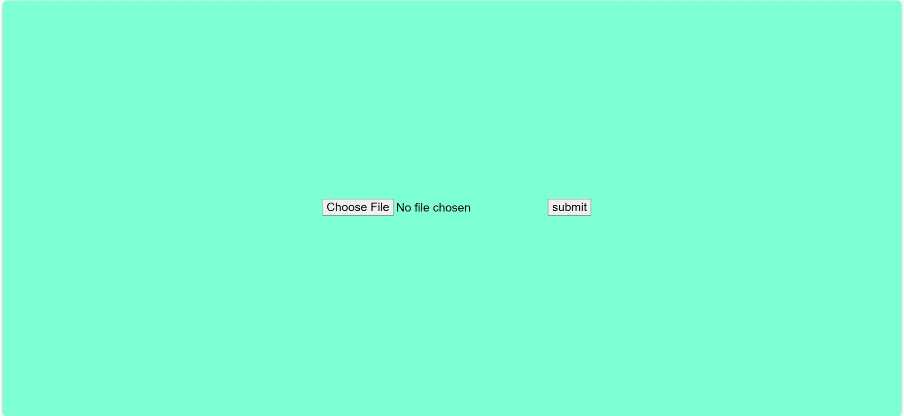
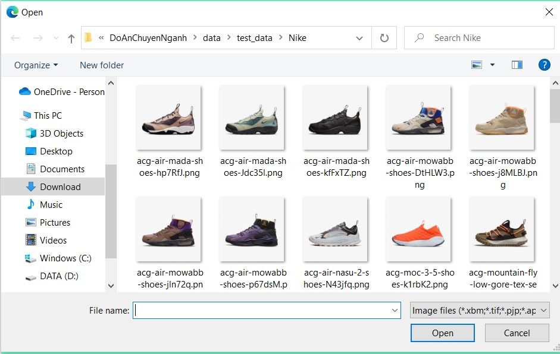

# INSTALL
**Conda instalation**
 `conda create -n my_env environmental.yml ` 
 **Python instalation**
 `python -m pip install requirements.txt` 
# RUN
**Conda**
  `flask --app main run` 
 **Python**
  `flask --app main run` 
 Then you can open http://127.0.0.1:5000 and try it!!! 
# RESULT
 ##**GUI** 
  
 ##**Choice one image** 
  
 ##**Get the result** 
  
